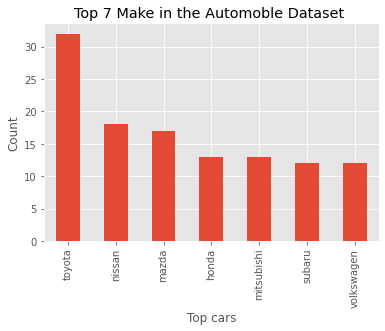
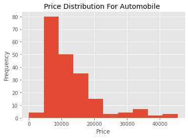
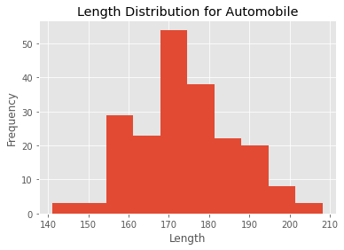
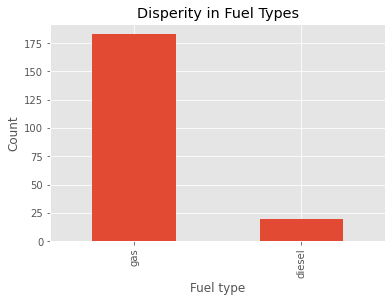
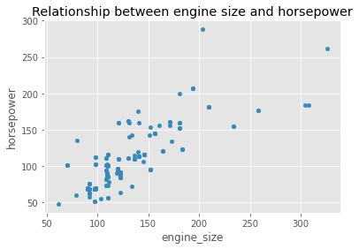
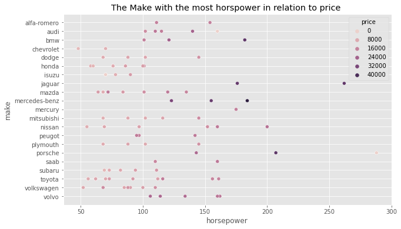
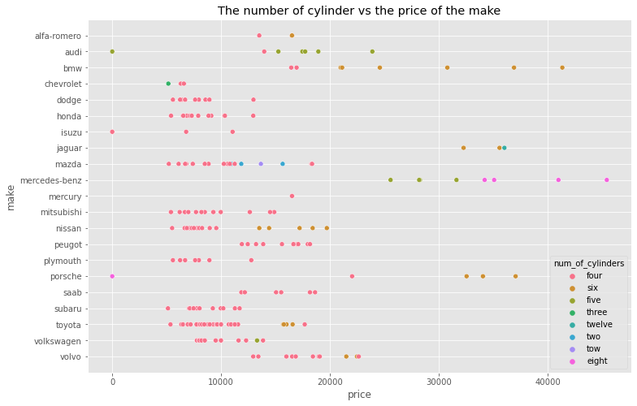
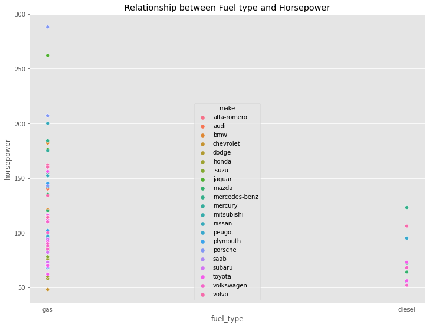
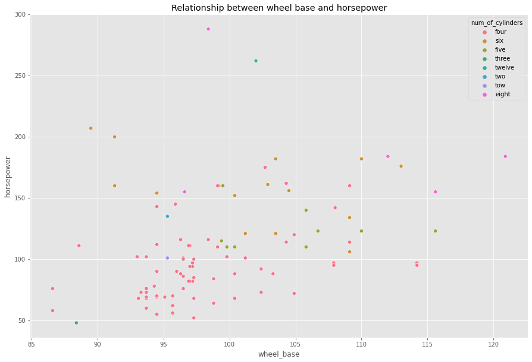
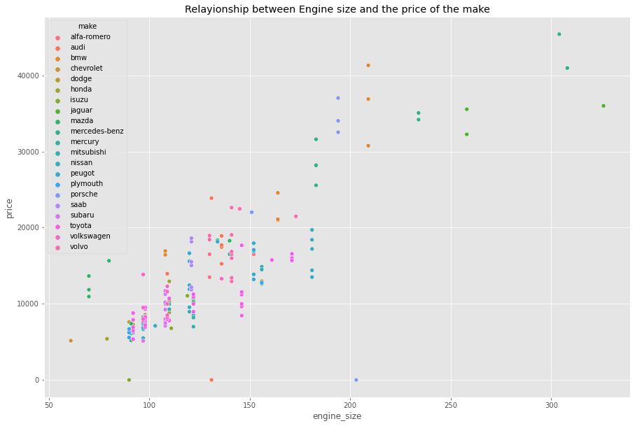

```python
import pandas as ps
import numpy as np
import matplotlib.pylab as plt
plt.style.use('ggplot')
import seaborn as sns
print("all good ")
```

    all good 


```python
df=ps.read_csv('Desktop/Data_tool/automobile_data.csv')

```


```python
df
```


<div>
<style scoped>
    .dataframe tbody tr th:only-of-type {
        vertical-align: middle;
    }

    .dataframe tbody tr th {
        vertical-align: top;
    }

    .dataframe thead th {
        text-align: right;
    }
</style>
<table border="1" class="dataframe">
  <thead>
    <tr style="text-align: right;">
      <th></th>
      <th>make</th>
      <th>fuel_type</th>
      <th>num_of_doors</th>
      <th>body_style</th>
      <th>drive_wheels</th>
      <th>engine_location</th>
      <th>wheel_base</th>
      <th>length</th>
      <th>width</th>
      <th>height</th>
      <th>curb_weight</th>
      <th>engine_type</th>
      <th>num_of_cylinders</th>
      <th>engine_size</th>
      <th>fuel_system</th>
      <th>compression_ratio</th>
      <th>horsepower</th>
      <th>city_mpg</th>
      <th>highway_mpg</th>
      <th>price</th>
    </tr>
  </thead>
  <tbody>
    <tr>
      <th>0</th>
      <td>alfa-romero</td>
      <td>gas</td>
      <td>two</td>
      <td>convertible</td>
      <td>rwd</td>
      <td>front</td>
      <td>88.6</td>
      <td>168.8</td>
      <td>64.1</td>
      <td>48.8</td>
      <td>2548</td>
      <td>dohc</td>
      <td>four</td>
      <td>130</td>
      <td>mpfi</td>
      <td>9.0</td>
      <td>111</td>
      <td>21</td>
      <td>27</td>
      <td>13495</td>
    </tr>
    <tr>
      <th>1</th>
      <td>alfa-romero</td>
      <td>gas</td>
      <td>two</td>
      <td>convertible</td>
      <td>rwd</td>
      <td>front</td>
      <td>88.6</td>
      <td>168.8</td>
      <td>64.1</td>
      <td>48.8</td>
      <td>2548</td>
      <td>dohc</td>
      <td>four</td>
      <td>130</td>
      <td>mpfi</td>
      <td>9.0</td>
      <td>111</td>
      <td>21</td>
      <td>27</td>
      <td>16500</td>
    </tr>
    <tr>
      <th>2</th>
      <td>alfa-romero</td>
      <td>gas</td>
      <td>two</td>
      <td>hatchback</td>
      <td>rwd</td>
      <td>front</td>
      <td>94.5</td>
      <td>171.2</td>
      <td>65.5</td>
      <td>52.4</td>
      <td>2823</td>
      <td>ohcv</td>
      <td>six</td>
      <td>152</td>
      <td>mpfi</td>
      <td>9.0</td>
      <td>154</td>
      <td>19</td>
      <td>26</td>
      <td>16500</td>
    </tr>
    <tr>
      <th>3</th>
      <td>audi</td>
      <td>gas</td>
      <td>four</td>
      <td>sedan</td>
      <td>fwd</td>
      <td>front</td>
      <td>99.8</td>
      <td>176.6</td>
      <td>66.2</td>
      <td>54.3</td>
      <td>2337</td>
      <td>ohc</td>
      <td>four</td>
      <td>109</td>
      <td>mpfi</td>
      <td>70.0</td>
      <td>102</td>
      <td>24</td>
      <td>30</td>
      <td>13950</td>
    </tr>
    <tr>
      <th>4</th>
      <td>audi</td>
      <td>gas</td>
      <td>four</td>
      <td>sedan</td>
      <td>4wd</td>
      <td>front</td>
      <td>99.4</td>
      <td>176.6</td>
      <td>66.4</td>
      <td>54.3</td>
      <td>2824</td>
      <td>ohc</td>
      <td>five</td>
      <td>136</td>
      <td>mpfi</td>
      <td>8.0</td>
      <td>115</td>
      <td>18</td>
      <td>22</td>
      <td>17450</td>
    </tr>
    <tr>
      <th>...</th>
      <td>...</td>
      <td>...</td>
      <td>...</td>
      <td>...</td>
      <td>...</td>
      <td>...</td>
      <td>...</td>
      <td>...</td>
      <td>...</td>
      <td>...</td>
      <td>...</td>
      <td>...</td>
      <td>...</td>
      <td>...</td>
      <td>...</td>
      <td>...</td>
      <td>...</td>
      <td>...</td>
      <td>...</td>
      <td>...</td>
    </tr>
    <tr>
      <th>198</th>
      <td>volvo</td>
      <td>gas</td>
      <td>four</td>
      <td>sedan</td>
      <td>rwd</td>
      <td>front</td>
      <td>109.1</td>
      <td>188.8</td>
      <td>68.9</td>
      <td>55.5</td>
      <td>2952</td>
      <td>ohc</td>
      <td>four</td>
      <td>141</td>
      <td>mpfi</td>
      <td>9.5</td>
      <td>114</td>
      <td>23</td>
      <td>28</td>
      <td>16845</td>
    </tr>
    <tr>
      <th>199</th>
      <td>volvo</td>
      <td>gas</td>
      <td>four</td>
      <td>sedan</td>
      <td>rwd</td>
      <td>front</td>
      <td>109.1</td>
      <td>188.8</td>
      <td>68.8</td>
      <td>55.5</td>
      <td>3049</td>
      <td>ohc</td>
      <td>four</td>
      <td>141</td>
      <td>mpfi</td>
      <td>8.7</td>
      <td>160</td>
      <td>19</td>
      <td>25</td>
      <td>19045</td>
    </tr>
    <tr>
      <th>200</th>
      <td>volvo</td>
      <td>gas</td>
      <td>four</td>
      <td>sedan</td>
      <td>rwd</td>
      <td>front</td>
      <td>109.1</td>
      <td>188.8</td>
      <td>68.9</td>
      <td>55.5</td>
      <td>3012</td>
      <td>ohcv</td>
      <td>six</td>
      <td>173</td>
      <td>mpfi</td>
      <td>8.8</td>
      <td>134</td>
      <td>18</td>
      <td>23</td>
      <td>21485</td>
    </tr>
    <tr>
      <th>201</th>
      <td>volvo</td>
      <td>diesel</td>
      <td>four</td>
      <td>sedan</td>
      <td>rwd</td>
      <td>front</td>
      <td>109.1</td>
      <td>188.8</td>
      <td>68.9</td>
      <td>55.5</td>
      <td>3217</td>
      <td>ohc</td>
      <td>six</td>
      <td>145</td>
      <td>idi</td>
      <td>23.0</td>
      <td>106</td>
      <td>26</td>
      <td>27</td>
      <td>22470</td>
    </tr>
    <tr>
      <th>202</th>
      <td>volvo</td>
      <td>gas</td>
      <td>four</td>
      <td>sedan</td>
      <td>rwd</td>
      <td>front</td>
      <td>109.1</td>
      <td>188.8</td>
      <td>68.9</td>
      <td>55.5</td>
      <td>3062</td>
      <td>ohc</td>
      <td>four</td>
      <td>141</td>
      <td>mpfi</td>
      <td>9.5</td>
      <td>114</td>
      <td>19</td>
      <td>25</td>
      <td>22625</td>
    </tr>
  </tbody>
</table>
<p>203 rows × 20 columns</p>
</div>


```python
df.info()
```

    <class 'pandas.core.frame.DataFrame'>
    RangeIndex: 203 entries, 0 to 202
    Data columns (total 15 columns):
     #   Column            Non-Null Count  Dtype  
    ---  ------            --------------  -----  
     0   make              203 non-null    object 
     1   fuel_type         203 non-null    object 
     2   body_style        203 non-null    object 
     3   wheel_base        203 non-null    float64
     4   length            203 non-null    float64
     5   width             203 non-null    float64
     6   height            203 non-null    float64
     7   curb_weight       203 non-null    int64  
     8   engine_type       203 non-null    object 
     9   num_of_cylinders  203 non-null    object 
     10  engine_size       203 non-null    int64  
     11  fuel_system       203 non-null    object 
     12  horsepower        203 non-null    int64  
     13  highway_mpg       203 non-null    int64  
     14  price             203 non-null    int64  
    dtypes: float64(4), int64(5), object(6)
    memory usage: 23.9+ KB


The dataset presented to us shows that it 203 columns and 15 rows, It also shows that we were working with a mixed dataset as it had both numerical and text data. 


```python
# Basic Data Uderstandsing 
df.shape
df['horsepower'].mean()
```


    104.25615763546799


```python
df[['price','make']].min
```


    <bound method NDFrame._add_numeric_operations.<locals>.min of      price         make
    0    13495  alfa-romero
    1    16500  alfa-romero
    2    16500  alfa-romero
    3    13950         audi
    4    17450         audi
    ..     ...          ...
    198  16845        volvo
    199  19045        volvo
    200  21485        volvo
    201  22470        volvo
    202  22625        volvo
    
    [203 rows x 2 columns]>


```python
df[['price','make']].max()
```


    price    45400
    make     volvo
    dtype: object


```python
df['length'].min()
```


    141.1


```python
df['length'].max()
```


    208.1


```python
df['height'].min()
```


    47.8


```python
df.describe()
```


<div>
<style scoped>
    .dataframe tbody tr th:only-of-type {
        vertical-align: middle;
    }

    .dataframe tbody tr th {
        vertical-align: top;
    }

    .dataframe thead th {
        text-align: right;
    }
</style>
<table border="1" class="dataframe">
  <thead>
    <tr style="text-align: right;">
      <th></th>
      <th>wheel_base</th>
      <th>length</th>
      <th>width</th>
      <th>height</th>
      <th>curb_weight</th>
      <th>engine_size</th>
      <th>compression_ratio</th>
      <th>horsepower</th>
      <th>city_mpg</th>
      <th>highway_mpg</th>
      <th>price</th>
    </tr>
  </thead>
  <tbody>
    <tr>
      <th>count</th>
      <td>203.000000</td>
      <td>203.000000</td>
      <td>203.000000</td>
      <td>203.000000</td>
      <td>203.000000</td>
      <td>203.000000</td>
      <td>203.000000</td>
      <td>203.000000</td>
      <td>203.000000</td>
      <td>203.000000</td>
      <td>203.000000</td>
    </tr>
    <tr>
      <th>mean</th>
      <td>98.782759</td>
      <td>173.999015</td>
      <td>65.901478</td>
      <td>53.733498</td>
      <td>2555.921182</td>
      <td>126.857143</td>
      <td>10.452315</td>
      <td>104.256158</td>
      <td>25.241379</td>
      <td>30.748768</td>
      <td>12982.477833</td>
    </tr>
    <tr>
      <th>std</th>
      <td>6.045680</td>
      <td>12.385511</td>
      <td>2.154835</td>
      <td>2.442864</td>
      <td>523.205555</td>
      <td>41.845239</td>
      <td>5.792528</td>
      <td>39.714369</td>
      <td>6.570702</td>
      <td>6.920406</td>
      <td>8111.953571</td>
    </tr>
    <tr>
      <th>min</th>
      <td>86.600000</td>
      <td>141.100000</td>
      <td>60.300000</td>
      <td>47.800000</td>
      <td>1488.000000</td>
      <td>61.000000</td>
      <td>7.000000</td>
      <td>48.000000</td>
      <td>13.000000</td>
      <td>16.000000</td>
      <td>0.000000</td>
    </tr>
    <tr>
      <th>25%</th>
      <td>94.500000</td>
      <td>166.300000</td>
      <td>64.050000</td>
      <td>52.000000</td>
      <td>2145.000000</td>
      <td>97.000000</td>
      <td>8.550000</td>
      <td>70.000000</td>
      <td>19.000000</td>
      <td>25.000000</td>
      <td>7649.000000</td>
    </tr>
    <tr>
      <th>50%</th>
      <td>97.000000</td>
      <td>173.200000</td>
      <td>65.500000</td>
      <td>54.100000</td>
      <td>2414.000000</td>
      <td>119.000000</td>
      <td>9.000000</td>
      <td>95.000000</td>
      <td>24.000000</td>
      <td>30.000000</td>
      <td>10245.000000</td>
    </tr>
    <tr>
      <th>75%</th>
      <td>102.400000</td>
      <td>183.300000</td>
      <td>66.900000</td>
      <td>55.500000</td>
      <td>2943.500000</td>
      <td>143.000000</td>
      <td>9.400000</td>
      <td>116.000000</td>
      <td>30.000000</td>
      <td>35.000000</td>
      <td>16500.000000</td>
    </tr>
    <tr>
      <th>max</th>
      <td>120.900000</td>
      <td>208.100000</td>
      <td>72.300000</td>
      <td>59.800000</td>
      <td>4066.000000</td>
      <td>326.000000</td>
      <td>70.000000</td>
      <td>288.000000</td>
      <td>49.000000</td>
      <td>54.000000</td>
      <td>45400.000000</td>
    </tr>
  </tbody>
</table>
</div>


```python
# Data Peparation 
```


```python
df=df[['make', 'fuel_type', 'body_style',
     'wheel_base', 'length', 'width', 'height',
       'curb_weight', 'engine_type', 'num_of_cylinders', 'engine_size',
       'fuel_system', 'horsepower',
       'highway_mpg', 'price']].copy()
# df.drop( ' name of column ' , axis=1) alternative for droping a  single column 
```

We did a bit of cleaning to removed columns we assumed will not be beneficial to this analyisis. We belive that leaving them in the dataset would not had value to the findings needed. columns removed include: City_mpg and compression ratio. 


```python
df
```


<div>
<style scoped>
    .dataframe tbody tr th:only-of-type {
        vertical-align: middle;
    }

    .dataframe tbody tr th {
        vertical-align: top;
    }

    .dataframe thead th {
        text-align: right;
    }
</style>
<table border="1" class="dataframe">
  <thead>
    <tr style="text-align: right;">
      <th></th>
      <th>make</th>
      <th>fuel_type</th>
      <th>body_style</th>
      <th>wheel_base</th>
      <th>length</th>
      <th>width</th>
      <th>height</th>
      <th>curb_weight</th>
      <th>engine_type</th>
      <th>num_of_cylinders</th>
      <th>engine_size</th>
      <th>fuel_system</th>
      <th>horsepower</th>
      <th>highway_mpg</th>
      <th>price</th>
    </tr>
  </thead>
  <tbody>
    <tr>
      <th>0</th>
      <td>alfa-romero</td>
      <td>gas</td>
      <td>convertible</td>
      <td>88.6</td>
      <td>168.8</td>
      <td>64.1</td>
      <td>48.8</td>
      <td>2548</td>
      <td>dohc</td>
      <td>four</td>
      <td>130</td>
      <td>mpfi</td>
      <td>111</td>
      <td>27</td>
      <td>13495</td>
    </tr>
    <tr>
      <th>1</th>
      <td>alfa-romero</td>
      <td>gas</td>
      <td>convertible</td>
      <td>88.6</td>
      <td>168.8</td>
      <td>64.1</td>
      <td>48.8</td>
      <td>2548</td>
      <td>dohc</td>
      <td>four</td>
      <td>130</td>
      <td>mpfi</td>
      <td>111</td>
      <td>27</td>
      <td>16500</td>
    </tr>
    <tr>
      <th>2</th>
      <td>alfa-romero</td>
      <td>gas</td>
      <td>hatchback</td>
      <td>94.5</td>
      <td>171.2</td>
      <td>65.5</td>
      <td>52.4</td>
      <td>2823</td>
      <td>ohcv</td>
      <td>six</td>
      <td>152</td>
      <td>mpfi</td>
      <td>154</td>
      <td>26</td>
      <td>16500</td>
    </tr>
    <tr>
      <th>3</th>
      <td>audi</td>
      <td>gas</td>
      <td>sedan</td>
      <td>99.8</td>
      <td>176.6</td>
      <td>66.2</td>
      <td>54.3</td>
      <td>2337</td>
      <td>ohc</td>
      <td>four</td>
      <td>109</td>
      <td>mpfi</td>
      <td>102</td>
      <td>30</td>
      <td>13950</td>
    </tr>
    <tr>
      <th>4</th>
      <td>audi</td>
      <td>gas</td>
      <td>sedan</td>
      <td>99.4</td>
      <td>176.6</td>
      <td>66.4</td>
      <td>54.3</td>
      <td>2824</td>
      <td>ohc</td>
      <td>five</td>
      <td>136</td>
      <td>mpfi</td>
      <td>115</td>
      <td>22</td>
      <td>17450</td>
    </tr>
    <tr>
      <th>...</th>
      <td>...</td>
      <td>...</td>
      <td>...</td>
      <td>...</td>
      <td>...</td>
      <td>...</td>
      <td>...</td>
      <td>...</td>
      <td>...</td>
      <td>...</td>
      <td>...</td>
      <td>...</td>
      <td>...</td>
      <td>...</td>
      <td>...</td>
    </tr>
    <tr>
      <th>198</th>
      <td>volvo</td>
      <td>gas</td>
      <td>sedan</td>
      <td>109.1</td>
      <td>188.8</td>
      <td>68.9</td>
      <td>55.5</td>
      <td>2952</td>
      <td>ohc</td>
      <td>four</td>
      <td>141</td>
      <td>mpfi</td>
      <td>114</td>
      <td>28</td>
      <td>16845</td>
    </tr>
    <tr>
      <th>199</th>
      <td>volvo</td>
      <td>gas</td>
      <td>sedan</td>
      <td>109.1</td>
      <td>188.8</td>
      <td>68.8</td>
      <td>55.5</td>
      <td>3049</td>
      <td>ohc</td>
      <td>four</td>
      <td>141</td>
      <td>mpfi</td>
      <td>160</td>
      <td>25</td>
      <td>19045</td>
    </tr>
    <tr>
      <th>200</th>
      <td>volvo</td>
      <td>gas</td>
      <td>sedan</td>
      <td>109.1</td>
      <td>188.8</td>
      <td>68.9</td>
      <td>55.5</td>
      <td>3012</td>
      <td>ohcv</td>
      <td>six</td>
      <td>173</td>
      <td>mpfi</td>
      <td>134</td>
      <td>23</td>
      <td>21485</td>
    </tr>
    <tr>
      <th>201</th>
      <td>volvo</td>
      <td>diesel</td>
      <td>sedan</td>
      <td>109.1</td>
      <td>188.8</td>
      <td>68.9</td>
      <td>55.5</td>
      <td>3217</td>
      <td>ohc</td>
      <td>six</td>
      <td>145</td>
      <td>idi</td>
      <td>106</td>
      <td>27</td>
      <td>22470</td>
    </tr>
    <tr>
      <th>202</th>
      <td>volvo</td>
      <td>gas</td>
      <td>sedan</td>
      <td>109.1</td>
      <td>188.8</td>
      <td>68.9</td>
      <td>55.5</td>
      <td>3062</td>
      <td>ohc</td>
      <td>four</td>
      <td>141</td>
      <td>mpfi</td>
      <td>114</td>
      <td>25</td>
      <td>22625</td>
    </tr>
  </tbody>
</table>
<p>203 rows × 15 columns</p>
</div>


```python
df.rename(columns={'body_style':'Body_style','fuel_type':'Fuel_type','make':'Make','wheel_base':'Wheel_Base'})

```


<div>
<style scoped>
    .dataframe tbody tr th:only-of-type {
        vertical-align: middle;
    }

    .dataframe tbody tr th {
        vertical-align: top;
    }

    .dataframe thead th {
        text-align: right;
    }
</style>
<table border="1" class="dataframe">
  <thead>
    <tr style="text-align: right;">
      <th></th>
      <th>Make</th>
      <th>Fuel_type</th>
      <th>num_of_doors</th>
      <th>Body_style</th>
      <th>drive_wheels</th>
      <th>engine_location</th>
      <th>Wheel_Base</th>
      <th>length</th>
      <th>width</th>
      <th>height</th>
      <th>curb_weight</th>
      <th>engine_type</th>
      <th>num_of_cylinders</th>
      <th>engine_size</th>
      <th>fuel_system</th>
      <th>compression_ratio</th>
      <th>horsepower</th>
      <th>city_mpg</th>
      <th>highway_mpg</th>
      <th>price</th>
    </tr>
  </thead>
  <tbody>
    <tr>
      <th>0</th>
      <td>alfa-romero</td>
      <td>gas</td>
      <td>two</td>
      <td>convertible</td>
      <td>rwd</td>
      <td>front</td>
      <td>88.6</td>
      <td>168.8</td>
      <td>64.1</td>
      <td>48.8</td>
      <td>2548</td>
      <td>dohc</td>
      <td>four</td>
      <td>130</td>
      <td>mpfi</td>
      <td>9.0</td>
      <td>111</td>
      <td>21</td>
      <td>27</td>
      <td>13495</td>
    </tr>
    <tr>
      <th>1</th>
      <td>alfa-romero</td>
      <td>gas</td>
      <td>two</td>
      <td>convertible</td>
      <td>rwd</td>
      <td>front</td>
      <td>88.6</td>
      <td>168.8</td>
      <td>64.1</td>
      <td>48.8</td>
      <td>2548</td>
      <td>dohc</td>
      <td>four</td>
      <td>130</td>
      <td>mpfi</td>
      <td>9.0</td>
      <td>111</td>
      <td>21</td>
      <td>27</td>
      <td>16500</td>
    </tr>
    <tr>
      <th>2</th>
      <td>alfa-romero</td>
      <td>gas</td>
      <td>two</td>
      <td>hatchback</td>
      <td>rwd</td>
      <td>front</td>
      <td>94.5</td>
      <td>171.2</td>
      <td>65.5</td>
      <td>52.4</td>
      <td>2823</td>
      <td>ohcv</td>
      <td>six</td>
      <td>152</td>
      <td>mpfi</td>
      <td>9.0</td>
      <td>154</td>
      <td>19</td>
      <td>26</td>
      <td>16500</td>
    </tr>
    <tr>
      <th>3</th>
      <td>audi</td>
      <td>gas</td>
      <td>four</td>
      <td>sedan</td>
      <td>fwd</td>
      <td>front</td>
      <td>99.8</td>
      <td>176.6</td>
      <td>66.2</td>
      <td>54.3</td>
      <td>2337</td>
      <td>ohc</td>
      <td>four</td>
      <td>109</td>
      <td>mpfi</td>
      <td>70.0</td>
      <td>102</td>
      <td>24</td>
      <td>30</td>
      <td>13950</td>
    </tr>
    <tr>
      <th>4</th>
      <td>audi</td>
      <td>gas</td>
      <td>four</td>
      <td>sedan</td>
      <td>4wd</td>
      <td>front</td>
      <td>99.4</td>
      <td>176.6</td>
      <td>66.4</td>
      <td>54.3</td>
      <td>2824</td>
      <td>ohc</td>
      <td>five</td>
      <td>136</td>
      <td>mpfi</td>
      <td>8.0</td>
      <td>115</td>
      <td>18</td>
      <td>22</td>
      <td>17450</td>
    </tr>
    <tr>
      <th>...</th>
      <td>...</td>
      <td>...</td>
      <td>...</td>
      <td>...</td>
      <td>...</td>
      <td>...</td>
      <td>...</td>
      <td>...</td>
      <td>...</td>
      <td>...</td>
      <td>...</td>
      <td>...</td>
      <td>...</td>
      <td>...</td>
      <td>...</td>
      <td>...</td>
      <td>...</td>
      <td>...</td>
      <td>...</td>
      <td>...</td>
    </tr>
    <tr>
      <th>198</th>
      <td>volvo</td>
      <td>gas</td>
      <td>four</td>
      <td>sedan</td>
      <td>rwd</td>
      <td>front</td>
      <td>109.1</td>
      <td>188.8</td>
      <td>68.9</td>
      <td>55.5</td>
      <td>2952</td>
      <td>ohc</td>
      <td>four</td>
      <td>141</td>
      <td>mpfi</td>
      <td>9.5</td>
      <td>114</td>
      <td>23</td>
      <td>28</td>
      <td>16845</td>
    </tr>
    <tr>
      <th>199</th>
      <td>volvo</td>
      <td>gas</td>
      <td>four</td>
      <td>sedan</td>
      <td>rwd</td>
      <td>front</td>
      <td>109.1</td>
      <td>188.8</td>
      <td>68.8</td>
      <td>55.5</td>
      <td>3049</td>
      <td>ohc</td>
      <td>four</td>
      <td>141</td>
      <td>mpfi</td>
      <td>8.7</td>
      <td>160</td>
      <td>19</td>
      <td>25</td>
      <td>19045</td>
    </tr>
    <tr>
      <th>200</th>
      <td>volvo</td>
      <td>gas</td>
      <td>four</td>
      <td>sedan</td>
      <td>rwd</td>
      <td>front</td>
      <td>109.1</td>
      <td>188.8</td>
      <td>68.9</td>
      <td>55.5</td>
      <td>3012</td>
      <td>ohcv</td>
      <td>six</td>
      <td>173</td>
      <td>mpfi</td>
      <td>8.8</td>
      <td>134</td>
      <td>18</td>
      <td>23</td>
      <td>21485</td>
    </tr>
    <tr>
      <th>201</th>
      <td>volvo</td>
      <td>diesel</td>
      <td>four</td>
      <td>sedan</td>
      <td>rwd</td>
      <td>front</td>
      <td>109.1</td>
      <td>188.8</td>
      <td>68.9</td>
      <td>55.5</td>
      <td>3217</td>
      <td>ohc</td>
      <td>six</td>
      <td>145</td>
      <td>idi</td>
      <td>23.0</td>
      <td>106</td>
      <td>26</td>
      <td>27</td>
      <td>22470</td>
    </tr>
    <tr>
      <th>202</th>
      <td>volvo</td>
      <td>gas</td>
      <td>four</td>
      <td>sedan</td>
      <td>rwd</td>
      <td>front</td>
      <td>109.1</td>
      <td>188.8</td>
      <td>68.9</td>
      <td>55.5</td>
      <td>3062</td>
      <td>ohc</td>
      <td>four</td>
      <td>141</td>
      <td>mpfi</td>
      <td>9.5</td>
      <td>114</td>
      <td>19</td>
      <td>25</td>
      <td>22625</td>
    </tr>
  </tbody>
</table>
<p>203 rows × 20 columns</p>
</div>


We Did more cleaning by Renaming the columns


```python
df.rename(columns={'num_of_doors':'Number_of_Doors'})
```


<div>
<style scoped>
    .dataframe tbody tr th:only-of-type {
        vertical-align: middle;
    }

    .dataframe tbody tr th {
        vertical-align: top;
    }

    .dataframe thead th {
        text-align: right;
    }
</style>
<table border="1" class="dataframe">
  <thead>
    <tr style="text-align: right;">
      <th></th>
      <th>make</th>
      <th>fuel_type</th>
      <th>Number_of_Doors</th>
      <th>body_style</th>
      <th>drive_wheels</th>
      <th>engine_location</th>
      <th>wheel_base</th>
      <th>length</th>
      <th>width</th>
      <th>height</th>
      <th>curb_weight</th>
      <th>engine_type</th>
      <th>num_of_cylinders</th>
      <th>engine_size</th>
      <th>fuel_system</th>
      <th>compression_ratio</th>
      <th>horsepower</th>
      <th>city_mpg</th>
      <th>highway_mpg</th>
      <th>price</th>
    </tr>
  </thead>
  <tbody>
    <tr>
      <th>0</th>
      <td>alfa-romero</td>
      <td>gas</td>
      <td>two</td>
      <td>convertible</td>
      <td>rwd</td>
      <td>front</td>
      <td>88.6</td>
      <td>168.8</td>
      <td>64.1</td>
      <td>48.8</td>
      <td>2548</td>
      <td>dohc</td>
      <td>four</td>
      <td>130</td>
      <td>mpfi</td>
      <td>9.0</td>
      <td>111</td>
      <td>21</td>
      <td>27</td>
      <td>13495</td>
    </tr>
    <tr>
      <th>1</th>
      <td>alfa-romero</td>
      <td>gas</td>
      <td>two</td>
      <td>convertible</td>
      <td>rwd</td>
      <td>front</td>
      <td>88.6</td>
      <td>168.8</td>
      <td>64.1</td>
      <td>48.8</td>
      <td>2548</td>
      <td>dohc</td>
      <td>four</td>
      <td>130</td>
      <td>mpfi</td>
      <td>9.0</td>
      <td>111</td>
      <td>21</td>
      <td>27</td>
      <td>16500</td>
    </tr>
    <tr>
      <th>2</th>
      <td>alfa-romero</td>
      <td>gas</td>
      <td>two</td>
      <td>hatchback</td>
      <td>rwd</td>
      <td>front</td>
      <td>94.5</td>
      <td>171.2</td>
      <td>65.5</td>
      <td>52.4</td>
      <td>2823</td>
      <td>ohcv</td>
      <td>six</td>
      <td>152</td>
      <td>mpfi</td>
      <td>9.0</td>
      <td>154</td>
      <td>19</td>
      <td>26</td>
      <td>16500</td>
    </tr>
    <tr>
      <th>3</th>
      <td>audi</td>
      <td>gas</td>
      <td>four</td>
      <td>sedan</td>
      <td>fwd</td>
      <td>front</td>
      <td>99.8</td>
      <td>176.6</td>
      <td>66.2</td>
      <td>54.3</td>
      <td>2337</td>
      <td>ohc</td>
      <td>four</td>
      <td>109</td>
      <td>mpfi</td>
      <td>70.0</td>
      <td>102</td>
      <td>24</td>
      <td>30</td>
      <td>13950</td>
    </tr>
    <tr>
      <th>4</th>
      <td>audi</td>
      <td>gas</td>
      <td>four</td>
      <td>sedan</td>
      <td>4wd</td>
      <td>front</td>
      <td>99.4</td>
      <td>176.6</td>
      <td>66.4</td>
      <td>54.3</td>
      <td>2824</td>
      <td>ohc</td>
      <td>five</td>
      <td>136</td>
      <td>mpfi</td>
      <td>8.0</td>
      <td>115</td>
      <td>18</td>
      <td>22</td>
      <td>17450</td>
    </tr>
    <tr>
      <th>...</th>
      <td>...</td>
      <td>...</td>
      <td>...</td>
      <td>...</td>
      <td>...</td>
      <td>...</td>
      <td>...</td>
      <td>...</td>
      <td>...</td>
      <td>...</td>
      <td>...</td>
      <td>...</td>
      <td>...</td>
      <td>...</td>
      <td>...</td>
      <td>...</td>
      <td>...</td>
      <td>...</td>
      <td>...</td>
      <td>...</td>
    </tr>
    <tr>
      <th>198</th>
      <td>volvo</td>
      <td>gas</td>
      <td>four</td>
      <td>sedan</td>
      <td>rwd</td>
      <td>front</td>
      <td>109.1</td>
      <td>188.8</td>
      <td>68.9</td>
      <td>55.5</td>
      <td>2952</td>
      <td>ohc</td>
      <td>four</td>
      <td>141</td>
      <td>mpfi</td>
      <td>9.5</td>
      <td>114</td>
      <td>23</td>
      <td>28</td>
      <td>16845</td>
    </tr>
    <tr>
      <th>199</th>
      <td>volvo</td>
      <td>gas</td>
      <td>four</td>
      <td>sedan</td>
      <td>rwd</td>
      <td>front</td>
      <td>109.1</td>
      <td>188.8</td>
      <td>68.8</td>
      <td>55.5</td>
      <td>3049</td>
      <td>ohc</td>
      <td>four</td>
      <td>141</td>
      <td>mpfi</td>
      <td>8.7</td>
      <td>160</td>
      <td>19</td>
      <td>25</td>
      <td>19045</td>
    </tr>
    <tr>
      <th>200</th>
      <td>volvo</td>
      <td>gas</td>
      <td>four</td>
      <td>sedan</td>
      <td>rwd</td>
      <td>front</td>
      <td>109.1</td>
      <td>188.8</td>
      <td>68.9</td>
      <td>55.5</td>
      <td>3012</td>
      <td>ohcv</td>
      <td>six</td>
      <td>173</td>
      <td>mpfi</td>
      <td>8.8</td>
      <td>134</td>
      <td>18</td>
      <td>23</td>
      <td>21485</td>
    </tr>
    <tr>
      <th>201</th>
      <td>volvo</td>
      <td>diesel</td>
      <td>four</td>
      <td>sedan</td>
      <td>rwd</td>
      <td>front</td>
      <td>109.1</td>
      <td>188.8</td>
      <td>68.9</td>
      <td>55.5</td>
      <td>3217</td>
      <td>ohc</td>
      <td>six</td>
      <td>145</td>
      <td>idi</td>
      <td>23.0</td>
      <td>106</td>
      <td>26</td>
      <td>27</td>
      <td>22470</td>
    </tr>
    <tr>
      <th>202</th>
      <td>volvo</td>
      <td>gas</td>
      <td>four</td>
      <td>sedan</td>
      <td>rwd</td>
      <td>front</td>
      <td>109.1</td>
      <td>188.8</td>
      <td>68.9</td>
      <td>55.5</td>
      <td>3062</td>
      <td>ohc</td>
      <td>four</td>
      <td>141</td>
      <td>mpfi</td>
      <td>9.5</td>
      <td>114</td>
      <td>19</td>
      <td>25</td>
      <td>22625</td>
    </tr>
  </tbody>
</table>
<p>203 rows × 20 columns</p>
</div>


We noticed that there were null values present in the dataset, we removed all null values present in any column


```python
df.dropna(axis=0,how="any")
```


<div>
<style scoped>
    .dataframe tbody tr th:only-of-type {
        vertical-align: middle;
    }

    .dataframe tbody tr th {
        vertical-align: top;
    }

    .dataframe thead th {
        text-align: right;
    }
</style>
<table border="1" class="dataframe">
  <thead>
    <tr style="text-align: right;">
      <th></th>
      <th>make</th>
      <th>fuel_type</th>
      <th>num_of_doors</th>
      <th>body_style</th>
      <th>drive_wheels</th>
      <th>engine_location</th>
      <th>wheel_base</th>
      <th>length</th>
      <th>width</th>
      <th>height</th>
      <th>curb_weight</th>
      <th>engine_type</th>
      <th>num_of_cylinders</th>
      <th>engine_size</th>
      <th>fuel_system</th>
      <th>compression_ratio</th>
      <th>horsepower</th>
      <th>city_mpg</th>
      <th>highway_mpg</th>
      <th>price</th>
    </tr>
  </thead>
  <tbody>
    <tr>
      <th>0</th>
      <td>alfa-romero</td>
      <td>gas</td>
      <td>two</td>
      <td>convertible</td>
      <td>rwd</td>
      <td>front</td>
      <td>88.6</td>
      <td>168.8</td>
      <td>64.1</td>
      <td>48.8</td>
      <td>2548</td>
      <td>dohc</td>
      <td>four</td>
      <td>130</td>
      <td>mpfi</td>
      <td>9.0</td>
      <td>111</td>
      <td>21</td>
      <td>27</td>
      <td>13495</td>
    </tr>
    <tr>
      <th>1</th>
      <td>alfa-romero</td>
      <td>gas</td>
      <td>two</td>
      <td>convertible</td>
      <td>rwd</td>
      <td>front</td>
      <td>88.6</td>
      <td>168.8</td>
      <td>64.1</td>
      <td>48.8</td>
      <td>2548</td>
      <td>dohc</td>
      <td>four</td>
      <td>130</td>
      <td>mpfi</td>
      <td>9.0</td>
      <td>111</td>
      <td>21</td>
      <td>27</td>
      <td>16500</td>
    </tr>
    <tr>
      <th>2</th>
      <td>alfa-romero</td>
      <td>gas</td>
      <td>two</td>
      <td>hatchback</td>
      <td>rwd</td>
      <td>front</td>
      <td>94.5</td>
      <td>171.2</td>
      <td>65.5</td>
      <td>52.4</td>
      <td>2823</td>
      <td>ohcv</td>
      <td>six</td>
      <td>152</td>
      <td>mpfi</td>
      <td>9.0</td>
      <td>154</td>
      <td>19</td>
      <td>26</td>
      <td>16500</td>
    </tr>
    <tr>
      <th>3</th>
      <td>audi</td>
      <td>gas</td>
      <td>four</td>
      <td>sedan</td>
      <td>fwd</td>
      <td>front</td>
      <td>99.8</td>
      <td>176.6</td>
      <td>66.2</td>
      <td>54.3</td>
      <td>2337</td>
      <td>ohc</td>
      <td>four</td>
      <td>109</td>
      <td>mpfi</td>
      <td>70.0</td>
      <td>102</td>
      <td>24</td>
      <td>30</td>
      <td>13950</td>
    </tr>
    <tr>
      <th>4</th>
      <td>audi</td>
      <td>gas</td>
      <td>four</td>
      <td>sedan</td>
      <td>4wd</td>
      <td>front</td>
      <td>99.4</td>
      <td>176.6</td>
      <td>66.4</td>
      <td>54.3</td>
      <td>2824</td>
      <td>ohc</td>
      <td>five</td>
      <td>136</td>
      <td>mpfi</td>
      <td>8.0</td>
      <td>115</td>
      <td>18</td>
      <td>22</td>
      <td>17450</td>
    </tr>
    <tr>
      <th>...</th>
      <td>...</td>
      <td>...</td>
      <td>...</td>
      <td>...</td>
      <td>...</td>
      <td>...</td>
      <td>...</td>
      <td>...</td>
      <td>...</td>
      <td>...</td>
      <td>...</td>
      <td>...</td>
      <td>...</td>
      <td>...</td>
      <td>...</td>
      <td>...</td>
      <td>...</td>
      <td>...</td>
      <td>...</td>
      <td>...</td>
    </tr>
    <tr>
      <th>198</th>
      <td>volvo</td>
      <td>gas</td>
      <td>four</td>
      <td>sedan</td>
      <td>rwd</td>
      <td>front</td>
      <td>109.1</td>
      <td>188.8</td>
      <td>68.9</td>
      <td>55.5</td>
      <td>2952</td>
      <td>ohc</td>
      <td>four</td>
      <td>141</td>
      <td>mpfi</td>
      <td>9.5</td>
      <td>114</td>
      <td>23</td>
      <td>28</td>
      <td>16845</td>
    </tr>
    <tr>
      <th>199</th>
      <td>volvo</td>
      <td>gas</td>
      <td>four</td>
      <td>sedan</td>
      <td>rwd</td>
      <td>front</td>
      <td>109.1</td>
      <td>188.8</td>
      <td>68.8</td>
      <td>55.5</td>
      <td>3049</td>
      <td>ohc</td>
      <td>four</td>
      <td>141</td>
      <td>mpfi</td>
      <td>8.7</td>
      <td>160</td>
      <td>19</td>
      <td>25</td>
      <td>19045</td>
    </tr>
    <tr>
      <th>200</th>
      <td>volvo</td>
      <td>gas</td>
      <td>four</td>
      <td>sedan</td>
      <td>rwd</td>
      <td>front</td>
      <td>109.1</td>
      <td>188.8</td>
      <td>68.9</td>
      <td>55.5</td>
      <td>3012</td>
      <td>ohcv</td>
      <td>six</td>
      <td>173</td>
      <td>mpfi</td>
      <td>8.8</td>
      <td>134</td>
      <td>18</td>
      <td>23</td>
      <td>21485</td>
    </tr>
    <tr>
      <th>201</th>
      <td>volvo</td>
      <td>diesel</td>
      <td>four</td>
      <td>sedan</td>
      <td>rwd</td>
      <td>front</td>
      <td>109.1</td>
      <td>188.8</td>
      <td>68.9</td>
      <td>55.5</td>
      <td>3217</td>
      <td>ohc</td>
      <td>six</td>
      <td>145</td>
      <td>idi</td>
      <td>23.0</td>
      <td>106</td>
      <td>26</td>
      <td>27</td>
      <td>22470</td>
    </tr>
    <tr>
      <th>202</th>
      <td>volvo</td>
      <td>gas</td>
      <td>four</td>
      <td>sedan</td>
      <td>rwd</td>
      <td>front</td>
      <td>109.1</td>
      <td>188.8</td>
      <td>68.9</td>
      <td>55.5</td>
      <td>3062</td>
      <td>ohc</td>
      <td>four</td>
      <td>141</td>
      <td>mpfi</td>
      <td>9.5</td>
      <td>114</td>
      <td>19</td>
      <td>25</td>
      <td>22625</td>
    </tr>
  </tbody>
</table>
<p>201 rows × 20 columns</p>
</div>


df.isnull()


```python
df.duplicated()
```


    0      False
    1      False
    2      False
    3      False
    4      False
           ...  
    198    False
    199    False
    200    False
    201    False
    202    False
    Length: 203, dtype: bool


Part of the analyisis was to get the make mostlly represented in this dataset, It is see here that Toyota is the most represeted closely follwed by Mazda and Nissan. Theleast represented is Mecuery

We also noted that at least 14 of the cars made by toyota are hatchback. Over 50% of Mazda make in this dataset are hatchback. 

It was also noted that the only car represented my mecuery in this data set was a hatchback. 


```python
# Features Understandig. 
df[['make','body_style']].value_counts()
```


    make           body_style 
    toyota         hatchback      14
    mazda          hatchback      10
    toyota         sedan          10
    mitsubishi     hatchback       9
    nissan         sedan           9
    volkswagen     sedan           9
    volvo          sedan           8
    bmw            sedan           8
    mazda          sedan           7
    peugot         sedan           7
    honda          hatchback       7
    subaru         sedan           5
    nissan         hatchback       5
    honda          sedan           5
    dodge          hatchback       5
    audi           sedan           5
    plymouth       hatchback       4
    peugot         wagon           4
    mitsubishi     sedan           4
    mercedes-benz  sedan           4
    subaru         wagon           4
    toyota         wagon           4
    saab           hatchback       3
                   sedan           3
    subaru         hatchback       3
    toyota         hardtop         3
    nissan         wagon           3
    volvo          wagon           3
    jaguar         sedan           3
    isuzu          sedan           3
    dodge          sedan           3
    alfa-romero    convertible     2
    mercedes-benz  hardtop         2
    plymouth       sedan           2
    porsche        hardtop         2
                   hatchback       2
    chevrolet      hatchback       2
    dodge          wagon           1
    audi           hatchback       1
    volkswagen     wagon           1
    audi           wagon           1
    volkswagen     hatchback       1
                   convertible     1
    chevrolet      sedan           1
    alfa-romero    hatchback       1
    toyota         convertible     1
    honda          wagon           1
    nissan         hardtop         1
    mercedes-benz  convertible     1
    porsche        convertible     1
    plymouth       wagon           1
    mercedes-benz  wagon           1
    mercury        hatchback       1
    isuzu          hatchback       1
    dtype: int64


There were 203 Unique makes in the Data set used for this analysis. 


```python
df['make'].count()
```


    203


```python
df['make'].value_counts()
```


    toyota           32
    nissan           18
    mazda            17
    honda            13
    mitsubishi       13
    subaru           12
    volkswagen       12
    peugot           11
    volvo            11
    dodge             9
    mercedes-benz     8
    bmw               8
    audi              7
    plymouth          7
    saab              6
    porsche           5
    isuzu             4
    alfa-romero       3
    jaguar            3
    chevrolet         3
    mercury           1
    Name: make, dtype: int64


With exploratory analysis, we found out the top 7 make of cars that are repesented in the dataset. with a count to give a better understanding of the data we are working with..

```
ax=df['make'].value_counts()\
.head(7)\
.plot(kind='bar', title ='Top 7 Make in the Automoble Dataset ')
ax.set_xlabel('Top cars')
ax.set_ylabel('Count')

```


```python

```


    Text(0, 0.5, 'Count')


    

    


Using matplot library wewere able to check the price distributuion in the dataset. The findings shows that most cars were rannged between 10,000-20,00. 

```
ax=df['price'].plot(kind='hist',bins=10,title='Price Distribution For Automobile ')
ax.set_xlabel('Price')

```


```python

```


    Text(0.5, 0, 'Price')


    

    


we were also able to chek the distribution of the length of the vehicles  and we found out that most vehicles were between 100-200 feet. 

```
ax=df['length'].plot(kind='hist',title='Length Distribution for Automobile')
ax.set_xlabel('Length')

```


```python

```


    Text(0.5, 0, 'Length')


    

    


```python
ax=df['engine_size'].plot(kind='kde',title='Size Distribution for Automobile')
ax.set_xlabel('Sizes')
```


    Text(0.5, 0, 'Sizes')


    

    


We also noted that of the 203 and 3 vehicles in the dataset,180 gas fuel types wihile diseal was under 25. 

```
ax=df['fuel_type'].value_counts()\
.plot(kind='bar', title ='Disperity in Fuel Types')
ax.set_xlabel('Fuel type')
ax.set_ylabel('Count')

```


```python

```


    Text(0, 0.5, 'Count')


    

    


Using  scatterplot we were able to show reletionship between engine size and hosepower. The visualization shows that the bigger the engine the greater the horspower. However there  are engine sizes that are big with relatively less horspower 

```
df.plot(kind='scatter',x='engine_size',y='horsepower')

```


```python
df.plot(kind='scatter',x='engine_size',y='horsepower')
plt.title('Relationship between engine size and horsepower')
plt.show()
        
```


    

    


We wanted to dig further to see which make has the highest horsepower and if it is related to how much the vehicle cost. 

The plot shows that the more expesive the make the bigger the horspower. We also noted that the make with the most hosepower is Jaguar followed by porch and Benz.

```
plt.figure(figsize=(10,6))
sns.scatterplot(x='horsepower',y='make', hue='price',data=df).set(title='The Make with the most horspower in relation to price ')
plt.show()

```


```python

```


    

    


Here we can see from the scatter plot that there is a relationship between the number of cylinder of the make and the price of the make. 

The Make with the most cylinders was seen to be the most expensive. The 8 and 6 cylinders make were more expensive.

```
plt.figure(figsize=(12,8))
sns.scatterplot(x='price',y='make', hue='num_of_cylinders', data=df).set(title='The number of cylinder vs the price of the make')
plt.show()

```


```python


```


    

    


From this plot we can see that the gas engines had more horse power than diesel engines. Again we can see that the porsche and the Benz stands out.  


```
plt.figure(figsize=(12,9))
sns.scatterplot(x='fuel_type',y='horsepower',data=df,hue='make').set(title=' Relationship between Fuel type and Horsepower ')
plt.show()
```


```python

```


    

    


Here we can see that there is no positive relationship between the wheel base of the vehicle and the horse power. 


```
figsize=(15,10))
sns.scatterplot(x='wheel_base',y='horsepower',hue='num_of_cylinders',data=df).set(title='Relationship between wheel base and horsepower')
plt.show()

```


```python
plt.figure(

```


    

    


We can conclude that there is a positive relationship between engine size and price  . We can see also see that Jaguar has the biggeest engine size. The Benz is also up there in engine size. 

```

plt.figure(figsize=(15,10))
sns.scatterplot(data=df,x='engine_size',y='price',hue='make').set(title='Relayionship between Engine size and the price of the make')
plt.show()

```


```python

```


    

    


```python
df.describe()
```


<div>
<style scoped>
    .dataframe tbody tr th:only-of-type {
        vertical-align: middle;
    }

    .dataframe tbody tr th {
        vertical-align: top;
    }

    .dataframe thead th {
        text-align: right;
    }
</style>
<table border="1" class="dataframe">
  <thead>
    <tr style="text-align: right;">
      <th></th>
      <th>wheel_base</th>
      <th>length</th>
      <th>width</th>
      <th>height</th>
      <th>curb_weight</th>
      <th>engine_size</th>
      <th>compression_ratio</th>
      <th>horsepower</th>
      <th>city_mpg</th>
      <th>highway_mpg</th>
      <th>price</th>
    </tr>
  </thead>
  <tbody>
    <tr>
      <th>count</th>
      <td>203.000000</td>
      <td>203.000000</td>
      <td>203.000000</td>
      <td>203.000000</td>
      <td>203.000000</td>
      <td>203.000000</td>
      <td>203.000000</td>
      <td>203.000000</td>
      <td>203.000000</td>
      <td>203.000000</td>
      <td>203.000000</td>
    </tr>
    <tr>
      <th>mean</th>
      <td>98.782759</td>
      <td>173.999015</td>
      <td>65.901478</td>
      <td>53.733498</td>
      <td>2555.921182</td>
      <td>126.857143</td>
      <td>10.452315</td>
      <td>104.256158</td>
      <td>25.241379</td>
      <td>30.748768</td>
      <td>12982.477833</td>
    </tr>
    <tr>
      <th>std</th>
      <td>6.045680</td>
      <td>12.385511</td>
      <td>2.154835</td>
      <td>2.442864</td>
      <td>523.205555</td>
      <td>41.845239</td>
      <td>5.792528</td>
      <td>39.714369</td>
      <td>6.570702</td>
      <td>6.920406</td>
      <td>8111.953571</td>
    </tr>
    <tr>
      <th>min</th>
      <td>86.600000</td>
      <td>141.100000</td>
      <td>60.300000</td>
      <td>47.800000</td>
      <td>1488.000000</td>
      <td>61.000000</td>
      <td>7.000000</td>
      <td>48.000000</td>
      <td>13.000000</td>
      <td>16.000000</td>
      <td>0.000000</td>
    </tr>
    <tr>
      <th>25%</th>
      <td>94.500000</td>
      <td>166.300000</td>
      <td>64.050000</td>
      <td>52.000000</td>
      <td>2145.000000</td>
      <td>97.000000</td>
      <td>8.550000</td>
      <td>70.000000</td>
      <td>19.000000</td>
      <td>25.000000</td>
      <td>7649.000000</td>
    </tr>
    <tr>
      <th>50%</th>
      <td>97.000000</td>
      <td>173.200000</td>
      <td>65.500000</td>
      <td>54.100000</td>
      <td>2414.000000</td>
      <td>119.000000</td>
      <td>9.000000</td>
      <td>95.000000</td>
      <td>24.000000</td>
      <td>30.000000</td>
      <td>10245.000000</td>
    </tr>
    <tr>
      <th>75%</th>
      <td>102.400000</td>
      <td>183.300000</td>
      <td>66.900000</td>
      <td>55.500000</td>
      <td>2943.500000</td>
      <td>143.000000</td>
      <td>9.400000</td>
      <td>116.000000</td>
      <td>30.000000</td>
      <td>35.000000</td>
      <td>16500.000000</td>
    </tr>
    <tr>
      <th>max</th>
      <td>120.900000</td>
      <td>208.100000</td>
      <td>72.300000</td>
      <td>59.800000</td>
      <td>4066.000000</td>
      <td>326.000000</td>
      <td>70.000000</td>
      <td>288.000000</td>
      <td>49.000000</td>
      <td>54.000000</td>
      <td>45400.000000</td>
    </tr>
  </tbody>
</table>
</div>


```python


```


```python

```
